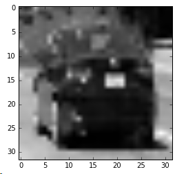

# Vehicle Detection Project

The goals / steps of this project are the following:

* Perform a Histogram of Oriented Gradients (HOG) feature extraction on a labeled training set of images and train a classifier Linear SVM classifier
* Optionally, you can also apply a color transform and append binned color features, as well as histograms of color, to your HOG feature vector. 
* Note: for those first two steps don't forget to normalize your features and randomize a selection for training and testing.
* Implement a sliding-window technique and use your trained classifier to search for vehicles in images.
* Run your pipeline on a video stream (start with the test_video.mp4 and later implement on full project_video.mp4) and create a heat map of recurring detections frame by frame to reject outliers and follow detected vehicles.
* Estimate a bounding box for vehicles detected.

## [Rubric](https://review.udacity.com/#!/rubrics/513/view) Points

All code is written in [project5.py](./project5.py) which is a Spyder file divided into cells.

### Histogram of Oriented Gradients (HOG)

#### 1. Explain how (and identify where in your code) you extracted HOG features from the training images.

The code for this step is contained in the function `extract_hog_features()`.

I started by reading in cartain `vehicle` and `non-vehicle` images.  Here is an example of one of each of the `vehicle` and `non-vehicle` classes:

After experimenting with various color spaces I found out that none of them quite worked for black or white cars so I decided to settle on gray colorspace for HOG calculation.

I then explored different different `skimage.hog()` parameters (`orientations`, `pixels_per_cell`, and `cells_per_block`).  I grabbed random images from each of the two classes and displayed them to get a feel for what the `skimage.hog()` output looks like.

Here is an example using the `gray` color space and HOG parameters of `orientations=16`, `pixels_per_cell=(8, 8)` and `cells_per_block=(2, 2)`:

and this is HOG of a railing (i.e. `non-vehicle`)

#### 2. Explain how you settled on your final choice of HOG parameters.

After trying out different HOG parameters I settled on resizing images to 64x64 pixels and using `orientations=16`, `pixels_per_cell=(8, 8)` and `cells_per_block=(2, 2)`.
Smaller inputs and smaller orientations were not achieving SVM training accuracy above `.92`. Smaller `pixels_per_cell` seemed to introduce too much noise and didn't perform well too.

#### Color features
I've used the following car features:

`bin_spatial()` - color features such as input image converted to HSV and resized to 32x32. The car on the image still remains recognizable:

`color_hist()` - HSV color histogram with H divided into 64 buckets, S into 48 and V into 32 according to their importance in feature detection. Usually vehicle images have some dominant color in the middle (color of the vehicle) and background color at the edges so combination of color histogram and small image allows detecting such scenarios.
However colors don't help in case of white and black cars so HOG is required too.
Here's how concatenated color histogram for a white car looks like:

#### 3. Describe how (and identify where in your code) you trained a classifier using your selected HOG features (and color features if you used them).

I used `StandardScaler` to normalize training data. Then I trained a linear SVM using 1000 examples from `vehicles/KITTI_extracted`, `vehicles/GTI_Right`, `vehicles/GTI_Far` and 500 examples from `non-vehicles/GTI/`, `non-vehicles/Extras/` and additional set of non-vehicle samples `non-vehicles/my/` to better avoid false positives. This is reasonable because in real life driverless car usually has information about _static_ surroundings including pictures such as from Google Street View. I used 30% of the image set for validation.
`LinearSVC` was overfitting too much so I tried `penalty=l1` and various `C` parameters and settled on leaving everything as default and setting `C=0.01`.

### Sliding Window Search

#### 1. Describe how (and identify where in your code) you implemented a sliding window search.  How did you decide what scales to search and how much to overlap windows?

I apply undistortion using calibration parameters from the previous project in function `undistort()`. After that sliding window search is applied.

I've tried sliding window sizes of 64, 96, 128, 196 and decided to keep only 64 and 128 to improve performance keeping quality of detection reasonably high.
Windows are shifting `1/4` of their size hence overlapping and creating heat map

Most of the time was spent in loading images and training itself was fairly quick:

    Total 1000 cars and 986 non-cars
    5.06 Seconds to train SVC...
    Test Accuracy of SVC =  0.9732

#### 2. Show some examples of test images to demonstrate how your pipeline is working.  What did you do to optimize the performance of your classifier?

Ultimately I searched on two scales using gray 1-channel HOG features plus spatially binned color and histograms of color in the feature vector. Here are some example heatmaps and final images:

---

### Video Implementation

#### 1. Provide a link to your final video output.  Your pipeline should perform reasonably well on the entire project video (somewhat wobbly or unstable bounding boxes are ok as long as you are identifying the vehicles most of the time with minimal false positives.)
Here's a [link to my video result](./project_video-output.mp4)

---

### Discussion

#### 1. Briefly discuss any problems / issues you faced in your implementation of this project.  Where will your pipeline likely fail?  What could you do to make it more robust?

This pipeline performs reasonably well on the given video. I had to add quite a lot of non-vehicle examples to avoid false positives. I believe that classifier based on convolutional neural network could perform better and faster on this task because it could avoid sliding window search (due to convolutions which are in a sense similar to sliding window search + heat map). The pipeline could have been imporoved by preserving bounding boxes between frames, trying to map them between frames and smoothing. Cross-frame heatmap was supposed to achieve that but I found it too slow to implement because it requires sliding windows to overlap significantly. Also two cars coming passing one another confuses this pipeline into thinking that it's a single car although they are clearly distinct by colors. Color histogram and spatial should have solved this problem but they didn't probably because HOG uses grayscale image where this difference is less noticeable. Possible I should have added this example into list of false positives and retrained model but I wanted to avoid training on vehicle examples from this particular test video because this whould obviously overfit the classifier.
